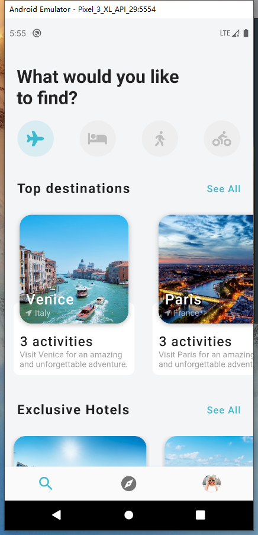
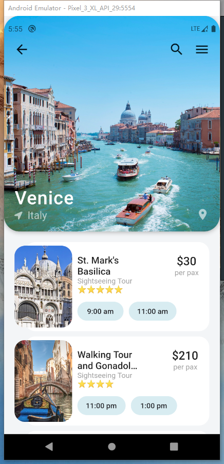

# Travel UI

> dribble 地址 ： https://dribbble.com/shots/6510521-Travel-App-for-booking-unique-experience

实现截图：





Gif :


## trick

    1. 沉浸式状态栏改变状态栏颜色
    2. NavigationBar 不显示 title

对于第一条的操作方法如下:

```dart
    void main() {
        if (Platform.isAndroid) {
            SystemUiOverlayStyle systemUiOverlayStyle = SystemUiOverlayStyle(
            statusBarColor: Colors.transparent,
        );
            SystemChrome.setSystemUIOverlayStyle(systemUiOverlayStyle);
        }
        runApp(MyApp());
    }

```

然后是改变状态栏字体颜色

```dart
// 找到原本的 主页Scaffold, 使其外层包裹上 AnnotatedRegion<SystemUiOverlayStyle>
    ··· some code ···
    return AnnotatedRegion<SystemUiOverlayStyle>(
      value: SystemUiOverlayStyle.dark,  // 有dark light 两种可选
      child: Scaffold(/*some code*/),
    )

```

最后是 NavigationBar , Flutter 在默认情况下是一定需要 title 属性的

```dart
BottomNavigationBarItem(icon: Icon(Icons.search, size: 30)), // ❌报错 title is required


// 最初的想法可能是 使用 Text("") 空字符串的方法隐藏掉 title 上面的字，但是发现图标会被向上推，导致状态栏看起来很别扭。
BottomNavigationBarItem(icon: Icon(Icons.search, size: 30),title: Text("")), // ✔ 也对


// 不过仔细想想，既然 Text() 本质是 widget 为什么不用 SizedBox ?
BottomNavigationBarItem(icon: Icon(Icons.search, size: 30),title: SizedBox.shrink()), // ✔ 完美
```
